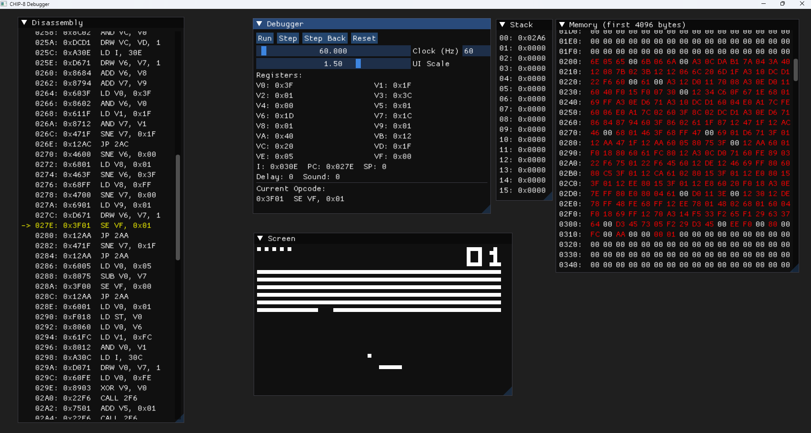

# CheckList

- [x] CHIP-8 Emulator using C++
- [ ] CHIP-8 Running on physical hardware
- [ ] CHIP-8 Compiler tools
- [ ] CHIP-8 ROM development tools

# CHIP-8 – Technical Reference

## Codebase Architecture

The app is split into four simple parts. The app connects the components; the CHIP-8 CPU owns emulated state and instructions; keyboard maps GLFW keys to the CHIP-8 keypad; display sends the framebuffer to OpenGL.

```text
                 +------------------+
                 |    App / main    |
                 | run loop + ImGui |
                 +--------+---------+
                          |
            +-------------+-------------+
            |                           |
     +------v------+             +------v------+
     | CHIP-8 CPU  |             |  Keyboard   |
     | Chip8.h     |             | Keyboard.*  |
     +------+------+             +-------------+
            |
     +------v------+
     |   Display   |
     |  Display.*  |
     +-------------+
```

`main.cpp` owns the desktop app and debugger UI. `Chip8.h` contains the CPU and machine state, `Keyboard.cpp` translates host key presses, and `Display.cpp` uploads the machine framebuffer for rendering.

*Based on Austin Morlan’s emulator build guide and the “Awesome CHIP-8” resource list.*

---

## 1. Introduction

CHIP-8 is a simple interpreted/virtual-machine language originally developed for the COSMAC VIP (and similar RCA 1802 systems) in the mid-1970s. It is widely used today as a learning project for emulator development.

---

## 2. System Architecture / Virtual Machine Specification

### 2.1 Memory

- **Total memory space**: 4096 bytes (0x000 to 0xFFF).
- **Memory segmentation**:
  - 0x000–0x1FF: Reserved for the interpreter on original hardware.
  - 0x050–0x0A0: Reserved for built-in font sprites.
  - 0x200 onward: ROM instructions begin here.

### 2.2 Registers

- **V0 to VF**: 16 general purpose 8-bit registers. VF is often used as a flag register for certain operations.
- **I**: Address register (16-bit) used to store memory addresses for some opcodes.
- **PC**: Program Counter – points to current instruction (16-bit to cover full range).

### 2.3 Stack and Stack Pointer

- A stack is used for subroutine call/return.
- **SP**: Stack pointer (8-bit) used to index into the stack array.

### 2.4 Timers

- Two 8-bit timers: **Delay Timer** and **Sound Timer**. Each decrements at ~60 Hz if non-zero.
- When the sound timer is non-zero, a beep is typically emitted.

### 2.5 Input

- Hexadecimal keypad: 16 keys (0–F).
- Typical mapping:
  ```
  Keypad   Keyboard
  1 2 3 C   1 2 3 4
  4 5 6 D   Q W E R
  7 8 9 E   A S D F
  A 0 B F   Z X C V
  ```
- Input opcodes: skip if key pressed, skip if key not pressed, wait for key press & store.

### 2.6 Graphics and Sound

- Display resolution: 64×32 pixels, monochrome.
- Sprites: 8 pixels wide, 1-15 rows high. Drawing uses XOR of sprite pixels with screen pixels; collision detection sets VF to 1 if any pixel was turned off.
- Sound: simple beep when sound timer > 0.

---

## 3. Emulator Structure (as per Morlan’s Guide)

### 3.1 Class Members (example structure)

```cpp
class Chip8 {
public:
    uint8_t registers[16]{};     // V0-VF
    uint8_t memory[4096]{};
    uint16_t index{};
    uint16_t pc{};
    uint16_t stack[16]{};
    uint8_t sp{};
    uint8_t delayTimer{};
    uint8_t soundTimer{};
    uint8_t keypad[16]{};
    uint32_t video[64 * 32]{};
    uint16_t opcode;
};
```

### 3.2 Loading a ROM

- Read the binary file into a buffer.
- Load it into memory starting at address 0x200.
- Initialize PC to 0x200 in constructor.

### 3.3 Loading the Font Set

- Built-in characters (0–F) each represented by 5 bytes (8×5 bit sprite).
- Load into memory starting at 0x50.

### 3.4 Random Number Generator

- For instruction `Cxkk` (RND Vx, byte).
- Use host language’s RNG to generate byte 0–255 and then AND with `kk`.

### 3.5 Fetch-Decode-Execute Loop

- Fetch two bytes from `memory[pc]` and `memory[pc+1]`, combine into 16-bit `opcode`.
- Decode by mask and switch/case on opcode’s high nibble and subfields.
- Execute: update registers/memory/video/timers accordingly. Then decrement timers at approx. 60 Hz.

### 3.6 Platform / Display Layer

- Use a graphics library (e.g., SDL) to render the `video` array (64×32) to screen, handle input mapping, timer interrupts, sound playback.

---

## 4. Opcode Set (Selected Examples)

| Opcode | Mnemonic | Description |
|--------|----------|-------------|
| `00E0` | CLS      | Clear the display. |
| `00EE` | RET      | Return from subroutine. |
| `1NNN` | JP addr  | Jump to address NNN. |
| `2NNN` | CALL addr| Call subroutine at NNN. |
| `3XKK` | SE Vx, byte | Skip next instruction if Vx == KK. |
| `4XKK` | SNE Vx, byte | Skip next if Vx != KK. |
| `6XKK` | LD Vx, byte | Set Vx = KK. |
| `7XKK` | ADD Vx, byte | Vx += KK. |
| `8XY4` | ADD Vx, Vy | Vx += Vy; VF = carry? |
| `DXYN` | DRW Vx, Vy, height | Display sprite at (Vx, Vy) of N bytes; VF = collision flag. |

---

## 5. Extensions & Variants

- **SUPER-CHIP (SCHIP)**: Adds higher resolution, additional opcodes.
- **CHIP-48**: For HP-48 calculators.
- **XO-CHIP**: Incorporates behavior from SCHIP and other extensions.

---

## 6. Implementation Tips & Considerations

- Use zero-initialised memory, registers, stack, video buffer at start.
- Map keypad inputs sensibly for your target platform.
- For drawing, sprites wrap around screen edges.
- Decrement timers at approx. 60 Hz rather than strict hardware cycle.
- Be aware of opcode quirks: Some instructions in historical interpreters had undefined/undocumented behavior; modern test ROMs may assume particular variant semantics.
- For debugging/emulator development: using a function-pointer table or large switch-case for opcode handling helps organisation.

---

## 7. Summary

CHIP-8 is a compact, educational virtual machine with minimal complexity: 4 KB memory, 16 registers, 16-level stack, simple graphics (64×32), timer and keypad. Because of its simplicity and well-documented opcode set and variants, it remains a common starting point for learning emulator development.

---

## 8. Further Reading & Resources

- Austin Morlan: *Building a CHIP-8 Emulator [C++]*. ([https://austinmorlan.com/posts/chip8_emulator/](https://austinmorlan.com/posts/chip8_emulator/))
- “Awesome CHIP-8” list of documentation, tools, resources. ([https://chip-8.github.io/links/](https://chip-8.github.io/links/))
- Cowgod’s CHIP-8 Technical Reference. ([https://devernay.free.fr/hacks/chip8/C8TECH10.HTM](https://devernay.free.fr/hacks/chip8/C8TECH10.HTM))

## Build and run on Windows

Install Visual Studio 2022 with the Desktop development with C++ workload and CMake. From a PowerShell prompt in the repository root, run:

```powershell
cmake -S . -B build -G "Visual Studio 17 2022" -A x64
cmake --build build --config Release
.\build\Release\chip8.exe
```

CMake downloads GLFW and Dear ImGui into `build/_deps` during the first configure. Enter a ROM path in the **Debugger** window and choose **Load** or **Browse...**, or open **File > Open ROM...** from the menu. Use **Run**, **Step**, or **Step Back** in the debugger. The CPU rate is capped at 1,000 cycles per second, with catch-up limited after a stalled frame.

### Keyboard and debugger controls

The CHIP-8 keypad maps to the keyboard like this:

```text
CHIP-8:  1 2 3 C     Keyboard:  1 2 3 4
         4 5 6 D                Q W E R
         7 8 9 E                A S D F
         A 0 B F                Z X C V
```

Use **Run/Pause** to start or stop execution, **Step** to execute one instruction, **Step Back** to restore the previous instruction state, and **Reset** to clear the emulator before loading another ROM. On first launch, the display, debugger, disassembly, memory, and stack windows are arranged in columns; choose **Window > Reset Window Positions** to restore that layout. ImGui remembers layout changes for later launches. **Help > About** shows the project attribution.

